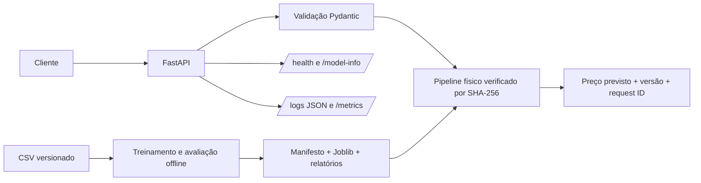

# Property Value Insights

Sistema reprodutível de estimativa de preços residenciais com Machine Learning e
práticas de MLOps. O projeto foi desenvolvido para o desafio técnico de previsão
de preços de imóveis e trata os dados como uma solução de cliente real.

Status atual: entrega final `v1.0.1`, com modelo, API, evidências de revisão e
imagem Docker reproduzível preparadas para avaliação técnica.

## Resultados principais

| Evidência | Resultado |
| --- | ---: |
| Vendas elegíveis após o filtro temporal | 21.595 |
| Validação cruzada temporal | 5 janelas expansivas |
| MAE média na validação temporal | US$ 63.880,80 |
| MAE no período diagnóstico | US$ 67.105,71 |
| R² / MAPE no período diagnóstico | 0,8998 / 12,07% |
| MAE no quartil superior | US$ 134.877,87 |
| Acima de US$ 1 milhão | MAE US$ 201.930,60; 69,55% de subestimação |
| Acima de US$ 2 milhões | 46 casos; MAE US$ 544.527,87; 82,61% de subestimação |

O modelo aprovado utiliza somente características físicas e espaciais. A
variante demográfica obteve ganho médio marginal na validação, mas ficou fora
do serving por risco de proxy socioeconômica, origem e vintage não documentados.


O gráfico pertence ao modelo físico servido. O período mais recente foi usado
como diagnóstico e já havia sido consultado; não é um teste final intocado.

## Identidade versionada

| Componente | Identidade vigente |
| --- | --- |
| Projeto/pacote | `property-value-insights 1.0.1` |
| Contrato da API | `0.5.0-rc1` |
| Modelo servido | `property_value_hist_gradient_boosting_physical 0.4.0-rc1` |
| Schema do manifesto | `1.0` |
| SHA-256 do artefato | `90ffbab62970c805b7fd65a5488fa727026bdc59b81d56726318374cdce8c439` |

As versões evoluem de forma independente. O valor
`property_value_insights=0.1.0.dev0` preservado no manifesto é
metadata histórica do ambiente que gerou o artefato imutável; ele não substitui
a release atual do projeto.

## Arquitetura executável



O runtime implementado é uma API local/containerizada. Registro de modelos,
staging, canary e rollback aparecem nos diagramas como arquitetura recomendada,
não como infraestrutura externa já implantada.

## Limites de uso

- segunda opinião quantitativa, não laudo ou decisão autônoma de crédito;
- as faixas observadas acima de US$ 1 milhão exigem revisão humana e, acima
  de US$ 2 milhões, avaliação especializada;
- no runtime, o gatilho não pode depender do preço real desconhecido nem somente
  da previsão pontual; a Issue #64 definirá sinais com previsão, intervalo,
  raridade e cobertura;
- ZIP desconhecido, coordenadas fora da região e anos futuros ainda não recebem
  warning estruturado no contrato atual; essa melhoria está registrada na Issue #64;
- a cobertura comprovada é regional, temporal e principalmente tabular.

As evidências completas estão nas reviews
[`C1.3`](docs/reviews/c1-3-model-review.md) e
[`C1.4`](docs/reviews/c1-4-data-quality-review.md).

## Ciclo de vida do projeto

As Fases 0–7 registram a construção da primeira versão estável. O Ciclo 1 de
revisão pré-entrega foi concluído com evidências independentes de API, modelo,
dados, documentação e operação. A versão `v1.0.1` consolida essa revisão e a
lapidação final sem alterar o modelo `0.4.0-rc1`, seu artefato, manifesto, hashes
ou previsões.

As Issues #62, #64, #65 e #70 permanecem como melhorias ou pesquisas futuras e
não representam funcionalidades incluídas nesta entrega. A consolidação completa
está em [`docs/reviews/cycle-1-consolidation.md`](docs/reviews/cycle-1-consolidation.md).

## Objetivo

Estimar o preço de imóveis a partir de características físicas e espaciais,
preservando rastreabilidade dos dados, validação, avaliação do modelo e
documentação das decisões técnicas. Informações demográficas agregadas por CEP
foram avaliadas por ablação, mas não integram o artefato aprovado.

## Dados

Os arquivos fornecidos estão versionados em `data/raw/`:

- `kc_house_data.csv`: histórico de imóveis com o alvo `price`;
- `zipcode_demographics.csv`: dados demográficos agregados por CEP;
- `future_unseen_examples.csv`: exemplos sem preço para a inferência final.

O contrato, a auditoria inicial e os hashes dos arquivos estão documentados em
[`docs/DATA_CONTRACT.md`](docs/DATA_CONTRACT.md) e no [`dicionário canônico`](docs/DATA_DICTIONARY.md). A especificação original do
desafio está preservada em [`docs/CHALLENGE_README.md`](docs/CHALLENGE_README.md).

## Execução local

O ambiente de referência usa Python 3.13 e `uv 0.12.1`. O arquivo `uv.lock`
fixa as dependências diretas e transitivas. No PowerShell:

```powershell
uv sync --locked --extra dev
uv run --locked ruff check .
uv run --locked pytest -q
uv run --locked verify-property-release --project-root .
uv run --locked python -m ipykernel install --user --name property-value-insights --display-name "Property Value Insights (project)"
uv run --locked jupyter nbconvert --to notebook --execute notebooks/01_eda.ipynb --inplace --ExecutePreprocessor.kernel_name=property-value-insights --ExecutePreprocessor.timeout=600
uv run --locked jupyter nbconvert --to notebook --execute notebooks/02_modeling.ipynb --inplace --ExecutePreprocessor.kernel_name=property-value-insights --ExecutePreprocessor.timeout=600
uv run --locked sanitize-property-notebooks --project-root .
uv run --locked python -m property_value_insights.training --project-root .
uv run --locked python -m property_value_insights.stakeholder_reporting --project-root .
uv run --locked python -m property_value_insights.uncertainty --project-root .
uv run --locked python -m property_value_insights.explainability --project-root .
docker compose up --build
```

O extra `dev` inclui as dependências de teste, notebooks e geração dos
relatórios. Para instalar somente o projeto e a explicabilidade, use
`uv sync --locked --extra explainability`. O extra `reporting` mantém apenas a
geração dos relatórios de negócio. A imagem de serving não inclui Matplotlib,
SHAP nem os dados brutos e executa somente a API de inferência.

## Imagem Docker da entrega

A release `v1.0.1` publica a imagem no GitHub Container Registry:

```bash
docker pull ghcr.io/umbura/property-value-insights:1.0.1
docker run --rm -p 8000:8000 --read-only --tmpfs /tmp \
  --security-opt no-new-privileges:true \
  ghcr.io/umbura/property-value-insights:1.0.1
```

A tag `latest` acompanha a release estável. Para reprodução estrita, use o digest
registrado pelo workflow de publicação e pela página do pacote. O serviço expõe
`/health`, `/model-info`, `/predict`, `/predict/batch`, `/metrics` e `/docs`.

## Modelo e artefato

O artefato principal usa características físicas e espaciais com
HistGradientBoostingRegressor e calibração temporal. A alternativa com dados
demográficos permanece documentada como experimento, mas não integra o modelo
empacotado devido ao ganho marginal e ao risco de proxies socioeconômicas.

O comando de treinamento valida a integridade temporal, exclui 18 registros
com eventos posteriores à venda, treina com 21.595 registros, verifica o
artefato por hash e gera as 100 previsões futuras. O contrato completo está em
[`docs/ARTIFACT_CONTRACT.md`](docs/ARTIFACT_CONTRACT.md).

## API de inferência

A API FastAPI carrega e verifica o artefato durante a inicialização. Ela oferece
predição individual e em lote, metadados do modelo, healthcheck, identificadores
de requisição, logs estruturados e métricas Prometheus. O contrato, os exemplos
de requisição e os limites operacionais estão em
[`docs/API_CONTRACT.md`](docs/API_CONTRACT.md).

Após `docker compose up --build`, a documentação OpenAPI fica disponível em
`http://127.0.0.1:8000/docs`. O contêiner executa como usuário sem privilégios e
é compatível com sistema de arquivos raiz somente leitura.

## Arquitetura e ciclo de vida

A solução distingue o runtime implementado da topologia recomendada para
produção. O [diagrama de arquitetura](diagrams/production_architecture.md) cobre
entrada, serving, observabilidade, CI/CD, registro e rollback. O
[ciclo de vida](diagrams/model_lifecycle.md) mostra a passagem de novos rótulos
por validação, treinamento, gates, staging, aprovação e monitoramento.

A estratégia de reentreinamento está em
[`docs/CONTINUOUS_LEARNING.md`](docs/CONTINUOUS_LEARNING.md). Ela não promove
modelos automaticamente: a automação prepara evidências, e a mudança do
champion exige critérios temporais e aprovação humana.

## Comunicação e governança

O [model card](docs/MODEL_CARD.md) registra uso pretendido, dados, métricas,
importância por permutação, desempenho por faixa, limitações e considerações éticas. O
[resumo para stakeholders](reports/stakeholder_summary.md) traduz as métricas
para decisão de negócio e utiliza um gráfico reproduzido especificamente para o
modelo físico aprovado.

## Análises opcionais

O diagnóstico opcional calibra um intervalo empírico com previsões fora de
amostra das cinco janelas de desenvolvimento e mede cobertura e largura no
período mais recente. Também gera explicações SHAP globais e locais diretamente
do Joblib verificado.
Os resultados e as ressalvas estão no
[`relatório de incerteza e explicabilidade`](reports/optional_analysis.md).

Essas rotinas são offline: não modificam o modelo promovido, as 100 previsões,
o contrato da API ou a imagem de serving. O intervalo não é apresentado como
garantia conformal, e as contribuições SHAP não são efeitos causais.

## Estrutura

```text
data/raw/       arquivos de entrada fornecidos
src/            código reutilizável do projeto
tests/          testes automatizados
docs/           contratos, releases, processo, arquivo e revisoes
artifacts/      artefato e manifesto versionados do modelo
reports/        relatorios e resultados gerados
notebooks/      analises exploratorias reproduziveis
diagrams/       diagramas de arquitetura e deploy
```

## Processo

As Fases 0–7 foram desenvolvidas por branches, commits atômicos, revisão
supervisionada e pull requests. O histórico completo dessa construção está em
[`PROCESSO_GIT_GITHUB.md`](docs/process/PROCESSO_GIT_GITHUB.md).

A revisão pré-entrega, a classificação das demandas e os ciclos atuais estão em
[`docs/REVIEW_AND_DELIVERY_PROCESS.md`](docs/REVIEW_AND_DELIVERY_PROCESS.md).

A estratégia de dependências, a verificação em ambiente limpo e as ações
manuais de publicação estão em
[`docs/RELEASE_READINESS.md`](docs/RELEASE_READINESS.md).

## Licença e dados

O código-fonte e a documentação original estão disponíveis sob a
[licença MIT](LICENSE). Os arquivos brutos recebidos para o desafio não são
relicenciados; as condições e os limites aplicáveis estão descritos no
[`DATA_NOTICE.md`](DATA_NOTICE.md).

As mudanças publicadas estão registradas no [`CHANGELOG.md`](CHANGELOG.md).
