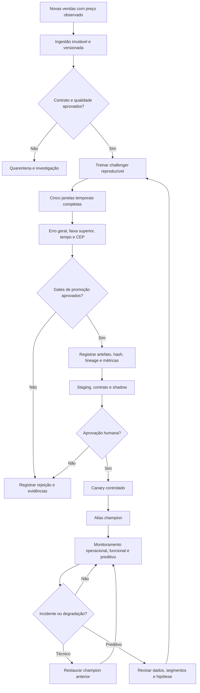

# Ciclo de vida do modelo

Nenhum drift isolado promove ou substitui um modelo. A automação prepara
evidências e bloqueia candidatos inválidos; a mudança do champion exige os
critérios documentados e aprovação humana.

O procedimento detalhado está em
[`docs/CONTINUOUS_LEARNING.md`](../docs/CONTINUOUS_LEARNING.md).
