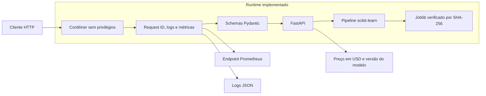
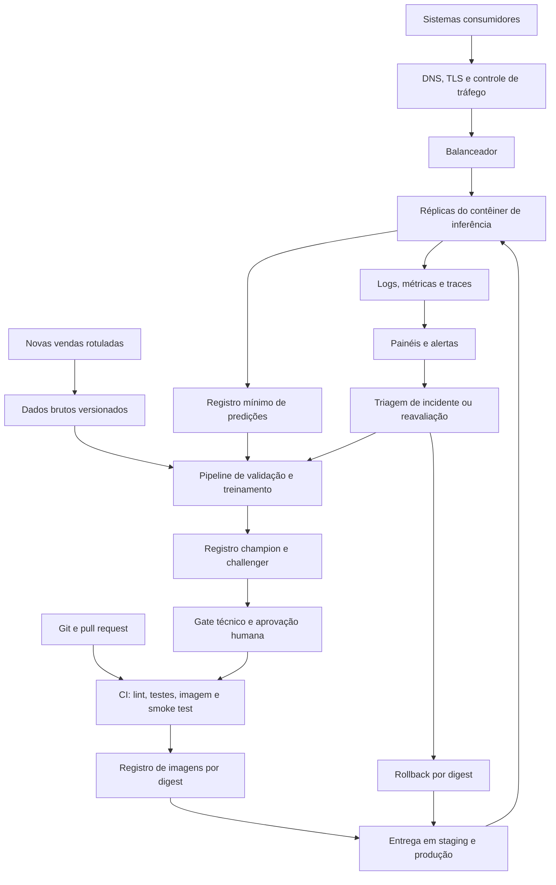

# Arquitetura de produção

## Escopo

Os diagramas separam o que pode ser executado neste repositório da topologia
recomendada para produção. Nenhum recurso de nuvem foi provisionado como parte
do desafio.

## Estado executável

O artefato é carregado uma vez no startup. Um manifesto inválido impede o
serviço de ficar saudável. A imagem inclui API, dependências, artefato e
manifesto, preservando uma unidade imutável de implantação.

## Topologia proposta

## Componentes

| Camada | Responsabilidade | Estado no projeto |
| --- | --- | --- |
| Entrada | TLS, autenticação, limite de corpo e taxa | Proposta |
| Balanceamento | Distribuir chamadas entre réplicas sem estado | Proposta |
| Inferência | Validar payload e executar o modelo | Implementada |
| Artefato | Garantir versão, hash e contrato de features | Implementada |
| Observabilidade | Requests, erros, latência, logs e correlação | Parcialmente implementada |
| Registro | Manter lineage e aliases `champion` e `challenger` | Proposta |
| CI/CD | Testar código e imagem; promover digest aprovado | CI implementada, entrega proposta |
| Dados | Preservar lotes brutos, rótulos e hashes | Contrato local implementado, storage proposto |
| Treinamento | Validar dados, treinar e avaliar temporalmente | Implementado sob demanda |
| Monitoramento preditivo | Avaliar drift, erro e segmentos após novos rótulos | Proposto |

## Fluxo de uma predição

1. A borda autentica o consumidor, aplica TLS e limita tráfego e tamanho.
2. O balanceador encaminha a requisição para uma réplica saudável.
3. A API valida tipos, domínios, campos desconhecidos e tamanho do lote.
4. O pipeline imutável produz o preço, a moeda e a versão do modelo.
5. O serviço registra duração, status e `request_id`, sem registrar o payload.
6. Um ledger protegido mantém somente os dados mínimos autorizados para ligar
   previsões a rótulos futuros.

## Estratégia de entrega

Cada imagem deve ser identificada por digest e carregar uma única versão do
modelo. `staging` recebe o digest candidato, executa smoke tests e compara o
contrato OpenAPI. Após aprovação, o mesmo digest é promovido para produção; a
imagem não é reconstruída entre ambientes.

O rollout começa sem tráfego ou em shadow, segue para uma parcela controlada e
só então substitui o champion. A versão anterior permanece disponível para
rollback. Promoção e rollback alteram o digest implantado, sem sobrescrever
artefatos existentes.

## Disponibilidade e capacidade

O serviço não mantém sessão e pode escalar horizontalmente. A recomendação é um
processo por contêiner, com limites explícitos de CPU e memória e múltiplas
réplicas quando a disponibilidade exigir. Os objetivos de latência,
disponibilidade e throughput devem ser definidos depois de teste de carga e de
requisitos do consumidor; o dataset não permite inventar esses valores.

Os indicadores mínimos são taxa de requisições, taxa de erro, duração por rota,
uso de recursos, reinicializações, sucesso do healthcheck e versão implantada.

## Segurança e privacidade

- executar como usuário sem privilégios e com raiz somente leitura;
- terminar TLS antes do contêiner e manter redes e credenciais segregadas;
- armazenar segredos em um cofre, nunca na imagem ou no repositório;
- não registrar características do imóvel nos logs operacionais;
- restringir o ledger de predições, aplicar retenção e auditar acessos;
- carregar Joblib somente de origem confiável e verificada;
- analisar dependências e a imagem antes da promoção.

## Falhas e recuperação

| Falha | Detecção | Resposta |
| --- | --- | --- |
| Manifesto ou hash inválido | Startup e healthcheck | Bloquear a réplica |
| Aumento de erros ou latência | Métricas operacionais | Interromper rollout ou reverter digest |
| Schema incompatível | Testes de contrato e HTTP 422 | Corrigir consumidor ou versionar a API |
| Drift sem rótulo | Monitoramento de entrada | Investigar; não promover automaticamente |
| Degradação com rótulo | Métricas temporais e por segmento | Reavaliar champion e challenger |
| Viés crescente no quartil superior | MAE, erro médio e taxa de subestimação | Bloquear promoção e revisar calibração |

## Mapeamento ilustrativo

Uma implantação AWS poderia mapear registro para ECR, execução para ECS
Fargate, entrada para ALB ou API Gateway, objetos para S3, segredos para Secrets
Manager e telemetria para CloudWatch ou Prometheus gerenciado. Essa lista é uma
opção de implementação, não uma afirmação de recursos criados.

As decisões metodológicas e operacionais estão fundamentadas em
[`docs/REFERENCES.md`](../docs/REFERENCES.md).
