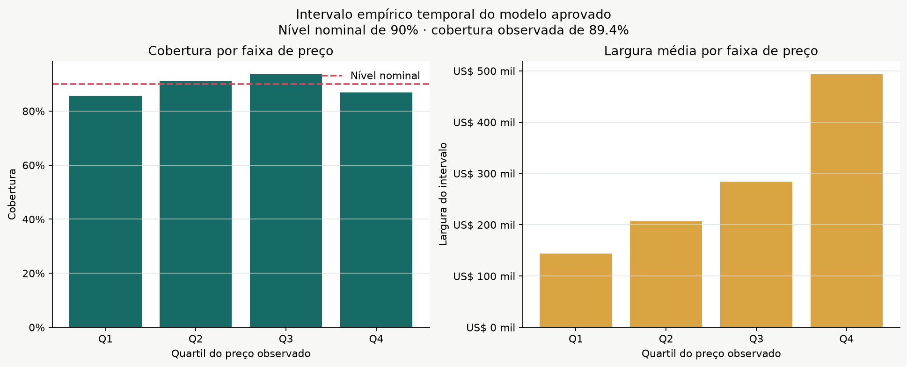
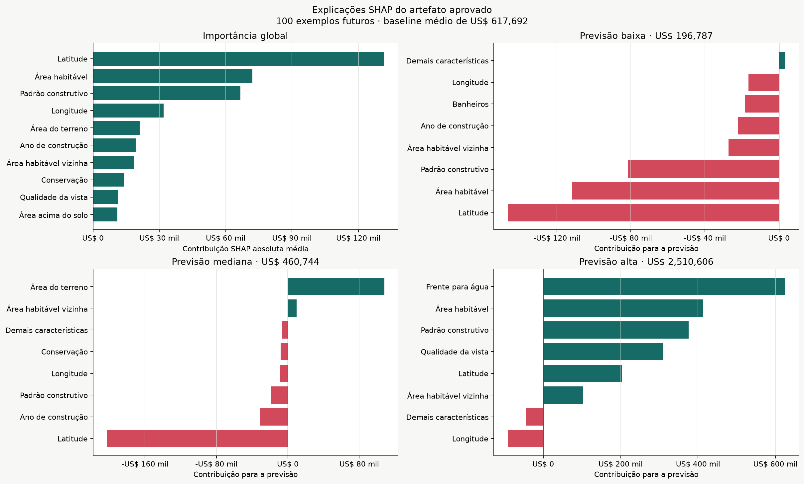

# Análise opcional: incerteza temporal e explicabilidade

## Escopo

Esta análise complementa o modelo físico aprovado sem alterar treinamento,
artefato, previsões futuras ou API. O intervalo e as explicações são gerados
offline e permanecem fora da imagem de serving.

## Intervalo empírico temporal

O nível nominal de 90% foi calibrado com 13.724 erros fora de amostra das cinco
janelas temporais de desenvolvimento. O quantil do erro absoluto em `log1p` foi
0,261692. As 4.640 vendas de 4 de março a 27 de maio de 2015 foram usadas apenas
para o diagnóstico abaixo.

| Faixa | Linhas | Cobertura | Largura média | Largura mediana |
| --- | ---: | ---: | ---: | ---: |
| Q1 | 1.169 | 85,71% | US$ 144.163,08 | US$ 142.524,41 |
| Q2 | 1.151 | 91,31% | US$ 206.500,44 | US$ 202.757,48 |
| Q3 | 1.162 | 93,72% | US$ 283.703,72 | US$ 279.534,01 |
| Q4 | 1.158 | 86,87% | US$ 493.820,50 | US$ 428.023,38 |

A cobertura geral foi de 89,40%. A largura média foi US$ 281.835,45, a mediana
foi US$ 239.598,20 e a largura média correspondeu a 52,94% da previsão central.
Q1 e Q4 ficaram abaixo do nível nominal; Q4 também apresentou a maior largura.

O quantil de 90% dos escores subiu de 0,245768 na terceira janela para 0,294591
na quinta. Essa variação reforça que a cobertura deve ser monitorada no tempo.
O método é um intervalo empírico temporal, não uma garantia conformal sob dados
futuros possivelmente dependentes ou sujeitos a mudança de distribuição.

## Explicabilidade SHAP

O `PermutationExplainer` processou as 100 linhas futuras com um baseline de 50
linhas históricas selecionadas deterministicamente. O valor-base médio foi
US$ 617.691,95. As maiores contribuições absolutas médias foram:

| Característica | Contribuição absoluta média |
| --- | ---: |
| Latitude | US$ 131.437,72 |
| Área habitável | US$ 72.108,70 |
| Padrão construtivo | US$ 66.675,50 |
| Longitude | US$ 32.020,75 |
| Área do terreno | US$ 21.175,38 |
| Ano de construção | US$ 19.340,56 |

As explicações locais representam as previsões baixa, mediana e alta do lote:
US$ 196.786,80, US$ 460.744,04 e US$ 2.510.606,44. A soma entre valor-base e
contribuições reproduziu as previsões com erro máximo de `1,40e-9`.

SHAP explica como o artefato se comportou em relação ao baseline. Não demonstra
efeito causal, mérito do imóvel ou acurácia, pois as linhas futuras não possuem
preço observado. Features espaciais e correlacionadas podem dividir ou
redistribuir atribuição.

## Rastreabilidade

- modelo: `property_value_hist_gradient_boosting_physical`;
- versão: `0.4.0-rc1`;
- SHA-256 do artefato: `90ffbab62970c805b7fd65a5488fa727026bdc59b81d56726318374cdce8c439`;
- SHAP: `0.52.0`;
- protocolo: [`docs/OPTIONAL_ANALYSIS_PROTOCOL.md`](../docs/OPTIONAL_ANALYSIS_PROTOCOL.md).

Os valores completos estão em
[`uncertainty_summary.json`](uncertainty_summary.json),
[`uncertainty_by_price_band.csv`](uncertainty_by_price_band.csv),
[`uncertainty_calibration_folds.csv`](uncertainty_calibration_folds.csv),
[`shap_metadata.json`](shap_metadata.json),
[`shap_global_importance.csv`](shap_global_importance.csv) e
[`shap_local_explanations.csv`](shap_local_explanations.csv).
