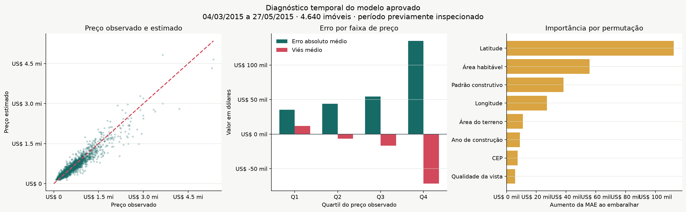

# Resumo executivo: estimativa de preços residenciais

## Decisão apoiada

O sistema fornece uma estimativa inicial de preço para organizar análises de
imóveis residenciais. Ele é adequado como segunda opinião quantitativa e como
filtro de priorização. Não substitui vistoria, avaliação formal nem decisão
humana de compra, venda ou crédito.

## Resultado principal

O modelo físico aprovado reduziu a MAE em 70,22% frente a uma referência que
atribui a todos os imóveis a mediana do período de desenvolvimento. No período
diagnóstico, a diferença absoluta média foi de US$ 67.105,71, contra
US$ 225.360,01 na referência.

R² foi 0,8998, mas esse número não representa 89,98% de acerto. Ele indica que o
modelo acompanha boa parte da variação observada neste recorte temporal. O erro
continua relevante para decisões individuais.

O gráfico à esquerda compara preço observado e estimado; pontos na diagonal
teriam previsão exata. O gráfico à direita mostra que erro e subestimação
crescem com o preço. Esses resultados pertencem ao modelo físico aprovado, não
ao experimento demográfico.

## Leitura por faixa

| Faixa | Linhas | MAE | Viés médio | Taxa de subestimação |
| --- | ---: | ---: | ---: | ---: |
| Q1 | 1.169 | US$ 35.309,65 | US$ 12.020,72 | 46,36% |
| Q2 | 1.151 | US$ 44.065,53 | -US$ 6.505,03 | 59,86% |
| Q3 | 1.162 | US$ 54.376,51 | -US$ 16.495,38 | 61,36% |
| Q4 | 1.158 | US$ 134.877,87 | -US$ 71.568,18 | 67,62% |

O principal risco de negócio está no Q4: imóveis acima de US$ 655.100 exigem
revisão reforçada, pois a diferença absoluta média dobra em relação ao resultado
geral e há tendência de subestimação.

## O que entrou no modelo

O treinamento final utilizou 21.595 vendas consistentes. O modelo considera 18
características físicas e espaciais, incluindo área, padrão construtivo,
condição, idade, CEP e coordenadas.

Dados demográficos foram avaliados, mas não incorporados. O ganho médio de MAE
foi de 0,71%, enquanto o uso adicionaria risco de proxies socioeconômicas. A
escolha preserva desempenho competitivo com menor superfície de dados.

## Fatores com maior influência

A importância por permutação mede quanto a MAE aumenta quando uma variável é
embaralhada, mantendo o restante do período diagnóstico. No modelo físico, os
maiores aumentos foram:

| Variável | Aumento da MAE |
| --- | ---: |
| Latitude | US$ 112.415,66 |
| Área habitável | US$ 55.841,29 |
| Padrão construtivo | US$ 38.219,50 |
| Longitude | US$ 27.246,21 |
| Área do terreno | US$ 11.005,30 |
| Ano de construção | US$ 8.924,98 |
| CEP | US$ 7.463,66 |
| Qualidade da vista | US$ 5.780,90 |

O resultado mostra dependência preditiva, não efeito causal. Latitude,
longitude e CEP também compartilham informação espacial, portanto seus valores
não devem ser interpretados como contribuições independentes.

## Recomendações de uso

1. Exibir preço estimado, moeda, versão e aviso de incerteza ao analista.
2. Encaminhar imóveis de maior valor e casos raros para avaliação especializada.
3. Registrar a decisão humana separadamente da previsão.
4. Comparar estimativa com preço observado quando a venda for concluída.
5. Monitorar erro, subestimação, tempo e regiões antes de ampliar o uso.

## Próxima decisão de negócio

Antes de produção, o responsável deve definir quem pode consultar o serviço,
qual decisão ele apoia, qual erro é tolerável por faixa e quem pode interromper
o uso. Esses requisitos determinam SLOs, capacidade, alertas e duração do
canary; o dataset sozinho não responde a essas perguntas.

## Transparência

- o histórico cobre maio de 2014 a maio de 2015 na região de Seattle;
- o período de março a maio de 2015 é diagnóstico e já foi inspecionado;
- as 100 previsões futuras não possuem preço observado e não medem acurácia;
- localização pode representar diferenças contextuais entre regiões;
- o modelo estima associação, não causa nem valor jurídico do imóvel.

Os números reproduzíveis estão em
[`approved_model_stakeholder_metrics.json`](approved_model_stakeholder_metrics.json)
e [`approved_model_price_bands.csv`](approved_model_price_bands.csv). A
importância completa está em
[`approved_model_feature_importance.csv`](approved_model_feature_importance.csv).
Os riscos e controles completos estão em
[`docs/MODEL_CARD.md`](../docs/MODEL_CARD.md).
